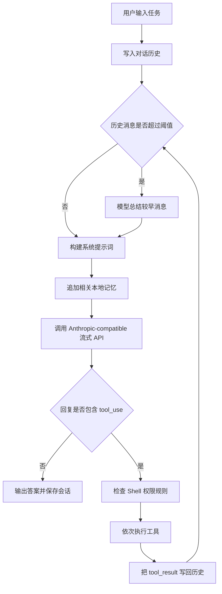

# MiniCode

MiniCode 是一个用 Python 从零实现的轻量级 coding agent CLI。项目围绕最小可运行的 Agent Loop 展开：模型读取用户任务、调用本地工具、接收工具结果，再继续推理，直到返回最终答案。

当前版本默认通过 Anthropic Python SDK 连接 DeepSeek Anthropic-compatible API，并使用 `deepseek-v4-pro`。这是学习项目，不是 Anthropic 官方产品，也不是完整的 Claude Code 替代品。

## 已实现能力

- 交互式 REPL 与单次命令两种运行方式
- Anthropic-compatible 流式响应
- 保留完整 `tool_use` / `tool_result` 的 Agent Loop
- 7 个基础工具：文件读写、精确编辑、文件列表、内容搜索、Shell、网页读取
- 写入前必须先读取文件，并使用修改时间检测外部变更
- 危险 Shell 命令的最小黑名单检查
- 本地会话保存、恢复和清空
- 超过阈值后自动压缩较早的对话历史
- 从 `.mini-memory/*.md` 按关键词召回最多 3 条本地记忆
- Rich 终端界面、流式文本与工具调用摘要

## 工作流程



核心约束：模型回复中的完整内容块必须原样保留。工具结果通过 `user` 消息返回，并用 `tool_use_id` 与对应调用关联；只保留文本会破坏后续工具协议。

## 环境要求

- Python 3.12 或更高版本
- [uv](https://docs.astral.sh/uv/)
- DeepSeek API Key，或其他与 Anthropic SDK 兼容的服务凭据

当前 CLI 主要在 macOS / Linux 上使用。入口文件直接导入 `readline`，Windows 尚未完成兼容处理。

## 安装

```bash
git clone https://github.com/MingWangD/MiniCode.git
cd MiniCode
uv sync
```

## 配置 DeepSeek

代码读取 Anthropic SDK 使用的环境变量：

```bash
export DEEPSEEK_API_KEY="你的 DeepSeek API Key"
export ANTHROPIC_API_KEY="$DEEPSEEK_API_KEY"
export ANTHROPIC_BASE_URL="https://api.deepseek.com/anthropic"
export MINI_MODEL="deepseek-v4-pro"
```

不要把真实 Key 写入 README、源码或 Git 提交。仓库已忽略 `.env`，但程序没有自动加载 `.env`；需要由 Shell 或其他环境管理工具导出变量。

Anthropic SDK 还可能读取 `ANTHROPIC_AUTH_TOKEN`。若 API Key 正确但仍返回 `401`，检查该变量是否保存了旧 token。不要直接修改可能被其他工具共用的全局配置；可先只对本次命令移除它：

```bash
env -u ANTHROPIC_AUTH_TOKEN uv run python -m mini_claude "只回复：OK"
```

## 使用

启动交互模式：

```bash
uv run python -m mini_claude
```

执行单次任务：

```bash
uv run python -m mini_claude "分析当前项目结构"
```

恢复上次会话：

```bash
uv run python -m mini_claude --resume
```

恢复历史并执行单次任务：

```bash
uv run python -m mini_claude --resume "继续上次任务"
```

当前 REPL 命令：

| 命令 | 作用 |
| --- | --- |
| `/clear` | 清空内存中的对话历史并覆盖本地会话文件 |
| `exit` / `quit` | 退出程序 |
| `Ctrl-D` | 通过 EOF 退出 |

会话保存在启动目录下的 `.mini-session.json`。该文件已被 Git 忽略。

## 工具系统

Agent 运行时只向模型暴露以下 7 个工具：

| 工具 | 作用 | 当前约束 |
| --- | --- | --- |
| `read_file` | 读取 UTF-8 文件并添加行号 | 无文件大小上限 |
| `write_file` | 创建或覆盖文件 | 覆盖已有文件前必须先读取 |
| `edit_file` | 唯一字符串替换并返回简化 diff | 旧文本必须唯一；兼容直引号与弯引号 |
| `list_files` | 按 glob 列出文件 | 跳过隐藏路径和 `node_modules`；最多展示 200 项 |
| `grep_search` | 正则搜索文件内容 | 优先使用系统 `grep`，失败后使用 Python；最多展示 100 条 |
| `run_shell` | 执行 Shell 命令 | 默认超时 30 秒；先经过危险命令黑名单 |
| `web_fetch` | 获取网页并把 HTML 转成文本 | 只接受 HTTP(S)；默认最多返回 50,000 字符 |

`tools.py` 还定义了 `skill`、`tool_search`、计划模式和子 Agent 的 schema，但 `Agent.CORE_TOOL_NAMES` 尚未开放这些工具，相关执行模块也未完成。

## 本地记忆

在启动目录创建 `.mini-memory`，放入 Markdown 文件：

```text
.mini-memory/
├── preferences.md
└── project.md
```

每轮请求会把用户输入按非单词字符切分，在所有 `.md` 文件中计算关键词重合数，并把分数最高的 3 条内容追加到系统提示词。

当前实现适合演示基础召回流程，不是向量检索：中文连续文本的分词效果有限，也没有自动写入、去重、索引或容量管理。记忆内容会进入模型上下文；不要保存 API Key、密码或不可信指令。`.mini-memory` 当前也未被 Git 自动忽略，提交前必须检查。

`memory.py` 中的 `_project_hash()` 目前仍是未接入的草稿，尚未返回哈希；实际记忆目录仍是启动目录下的 `.mini-memory`。

## 项目结构

```text
MiniCode/
├── mini_claude/
│   ├── __main__.py       # CLI 入口、REPL、--resume 与 /clear
│   ├── agent.py          # 流式 Agent Loop 与工具协议
│   ├── context.py        # 历史消息压缩
│   ├── frontmatter.py    # Markdown frontmatter 解析与格式化
│   ├── memory.py         # 本地 Markdown 关键词召回
│   ├── permissions.py    # Shell 危险命令黑名单
│   ├── prompt.py         # 系统提示词与环境上下文
│   ├── session.py        # JSON 会话持久化
│   ├── tools.py          # 工具 schema、实现与分派
│   ├── ui.py             # Rich 终端输出
│   ├── autonomy.py       # 预留：自主执行策略
│   ├── mcp_client.py     # 预留：MCP 客户端
│   ├── skills.py         # 预留：Skills
│   └── subagent.py       # 预留：子 Agent
├── pyproject.toml
├── uv.lock
└── README.md
```

## 模块状态

| 模块 | 状态 | 说明 |
| --- | --- | --- |
| CLI、Agent Loop、基础工具、UI | 已接入 | 构成当前可运行主链 |
| 会话恢复、上下文压缩 | 已接入 | 通过本地 JSON 与额外模型总结工作 |
| Memory | 基础版已接入 | 只读本地 Markdown 并做关键词重合召回 |
| Frontmatter | 已实现但未接入 | 可独立解析/格式化，运行主链尚未使用 |
| `CLAUDE.md` / rules 读取辅助函数 | 已实现但未接入 | `build_user_context_reminder()` 尚未由 Agent 调用 |
| `tool_search`、计划模式 | 只有 schema / 部分分派 | 运行时未向模型暴露 |
| Skills、子 Agent、MCP、自主执行 | 未实现 | 文件仍为空，占位供后续章节扩展 |

## 安全边界

当前版本只适合本地学习和受控实验：

- `permissions.py` 是正则黑名单，不是沙箱，也没有完整的人工审批流程。
- 文件工具可访问当前 Python 进程有权限访问的路径，并不限制在仓库根目录。
- `run_shell` 使用 `shell=True`，未命中黑名单的命令仍可能修改系统或访问网络。
- `web_fetch` 只限制 URL scheme，不提供内网隔离或完整 SSRF 防护。
- Memory 内容会直接追加到系统提示词，应只放可信文本。
- 工具调用当前串行执行；只读工具的并发标记尚未接入 Agent Loop。
- 超长 `read_file` 结果尚未持久化；极大文件可能快速占用模型上下文。

不要在生产环境、包含重要未备份数据的目录，或高权限账户下直接运行当前版本。

## 验证

检查依赖锁和 Python 语法：

```bash
uv lock --check
uv run python -m compileall -q mini_claude
```

执行真实 API 冒烟测试：

```bash
uv run python -m mini_claude "不要调用工具，只回复：OK"
```

仓库当前没有持久化的自动化测试套件。后续应为 Agent Loop、工具权限、会话序列化、上下文压缩和 Memory 召回补充单元测试及 fake-client 集成测试。

## 后续路线

1. 接入 frontmatter，并为 Memory 增加安全写入、索引和更适合中文的检索。
2. 实现并开放 `tool_search`、计划模式、Skills 和子 Agent。
3. 接入 MCP 客户端与配置加载。
4. 用允许列表、目录边界和显式用户确认替代最小 Shell 黑名单。
5. 持久化超长工具结果，并为只读工具增加受控并发。
6. 建立自动化测试、格式检查和 CI。

## 学习定位

项目按“从零理解 coding agent”路径推进，重点不是堆叠功能，而是看清以下数据流：完整消息历史、工具 schema、`tool_use`、本地执行、`tool_result`、再次调用模型。建议每次只完成一个可验证的小阶段，再继续扩展高级能力。

学习参考：[Windy3f3f3f/claude-code-from-scratch](https://github.com/Windy3f3f3f/claude-code-from-scratch)
